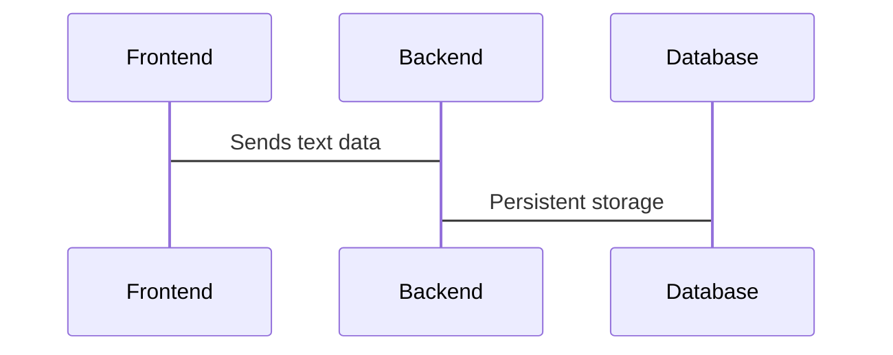

# The Best Note Taking app

Have you ever thougth about it?

<!--
The last comment block of each slide will be treated as slide notes. It will be visible and editable in Presenter Mode along with the slide. [Read more in the docs](https://sli.dev/guide/syntax.html#notes)
-->

---
transition: fade-out
title: Reasons why we take notes
---

# We take notes for many reasons

- to focus
  - your thoughts become more intentional
- to remember
- to study
  - have you ever borrowed somebody else's notes?
- to show interest
  - you need to remember what somebody is telling you

<!--
You can have `style` tag in markdown to override the style for the current page.
Learn more: https://sli.dev/guide/syntax#embedded-styles
-->

<!--
Here is another comment.
-->

---
layout: default
---

# Benefits of writing with pen and paper

* you will actively retain more of what you're writing
* when you are listening to someone it makes the situation more engaging

---
transition: slide-up
layout: default
level: 2
---

# Let's mention some note taking apps

* Apple Notes
* Microsoft OneNote
* Notion
* Text files
* Obsidian
* Bear (my favourite)

--- 
layout: default
---

# What are the differences?

Let's look at it from a technical point of view.

---
layout: default
---

# Offline first

I can write and search my notes without internet connection

I need to take a note whenever... 
It has to be quick and with basic tools, or I get lost in formatting and the various options.

---
layout: default
---

# Collaboration first

Google Docs and Notion are great for collaboration. Less for quick thinking.

---
layout: default
---

# Are you paying for your "go to" choice?

I am paying €6 a year for Bear to sync across devices

---
layout: two-cols
---

# Frontend

    

::right::

# Architecture

---

# How to achieve offline first?

* PWA
  * [vite-pwa](https://vite-pwa-org.netlify.app) not fully working
* IndexedDB

---

# How to achieve collaboration?

* Websockets 
* WebRTC?

---
layout: two-cols
---

# Discoveries

Libraries

* https://github.com/yjs/yjs
* https://tiptap.dev
* https://tiptap.dev/hocuspocus/

::right::

# CRDT

[Conflict-free Replicated Data Type](https://en.wikipedia.org/wiki/Conflict-free_replicated_data_type)

A Conflict-free Replicated Data Type (CRDT) is a data structure that simplifies distributed data storage systems and multi-user applications. In many systems, copies of some data need to be stored on multiple computers (known as replicas).

---
layout: two-cols
---

# Show me the code!
 
[GitHub: giacomorebonato/collab-editor](https://github.com/giacomorebonato/collab-editor)

## Tech used

* Fastify + Hocuspocus
* Monaco Editor
* TipTap Editor
* [Turso SQLite fork](https://turso.tech)

::right::

# Question?

One more thing...

How would you implement the full text search? Remember it has to work offline too.

Orama? [SQLite](https://github.com/sql-js/sql.js/)?

---
layout: center
---

# How log will it take for use to break it

https://collab-editor.fly.dev

  

